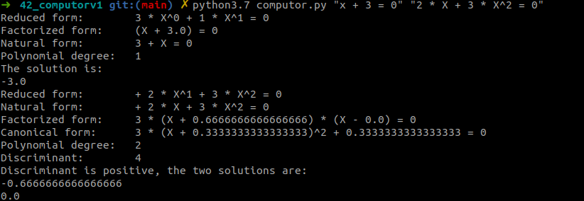

# Computorv1
This project is one of my 42 curriculum accessible after the Comon Core.

## Objectives
* basic concepts about polynomial equation and roots calculation
* basic parsing manipulation (regex of other) *for this project I did not use regular expression but Shunting-Yard algorithm to reorder to rules based parser into Polish Inverse Notation.*

Polynomial equations solver. For zeroth, The solver performs an explicit resolution (thus no iterative method is used to find the roots). It can solve polynomial equation of the order zeroth, first, second and third (bonus of the project).

## Skills
* Rigor
* Algorithms
* Mathematics *(not quite as it is too simple)*
* POO *(As I decide to overload the arithmetic operators in the Monomial, Polynomial and PolynomialBonus classes.)*


## In brief
### Prerequisites
The libraries **Numpy**, **Seaborn** are used. **Seaborn** has few build dependencies: **Pandas**, **Scipy** and **Matplotlib**.
You can just create a virtual environment and install the libraries via the *requirement.txt* file:
```bash
> python3.7 -m venv v_computorv1
> source v_computorv1/bin/activate
(v_computorv1) > pip install -r requirements.txt
```

### Run
The main is located in the file `computor.py`, so the solver is run via the command:
```bash
(v_computorv1) > python computor.py [ARGS]
```
`[ARGS]` refers to the arguments it should be one or several strings representing polynomial equations.\
**Examples**:
* `python computor.py "X = 0"`,
* `python computor.py "2 * X^0 - 5 * X^1 + 1 * X^2 = 0"`,
* `python computor.py "0 * X^0 - 15.3 * X^1 = 3 * X^0"`

### Output:

The output is constitued of different forms of the polynomial:
* reduced form,
* factorized form,
* natural form,
* polynomial order,
* discriminant for polynomial equation of second and third order,
* solution(s)/root(s) of the polynomial equation.

## Code autopsy
🚧👷‍♂️ ... 👷‍♂️🚧
### Dealing with the arguments
#### Parsing
🚧👷‍♂️ Set of rules 👷‍♂️🚧

#### Tokenizer
🚧👷‍♂️ ... 👷‍♂️🚧
#### Token sorting
🚧👷‍♂️ Shunting Yard algo, Operator precedence, Polish inverse notation 👷‍♂️🚧
### Development roots calculus and display

####  Overload of the artihmetic operators
🚧👷‍♂️ Monomial and Polynomial classes, `__add__`, `__radd__`, `__sub__`, `__rsub__` ... 👷‍♂️🚧
#### Solutions calculation
🚧👷‍♂️ First, second and third order polynomial 👷‍♂️🚧
#### Centering the polynomial representation
🚧👷‍♂️ ... 👷‍♂️🚧