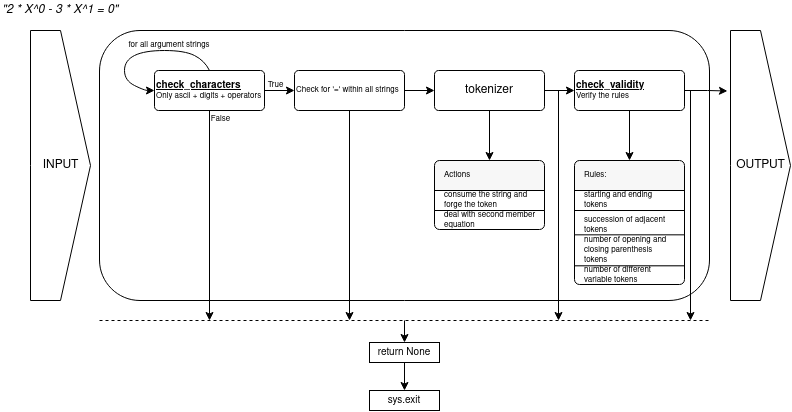

# Computorv1
This project is one of my 42 curriculum accessible after the Comon Core.

## Objectives
* basic concepts about polynomial equation and roots calculation
* basic parsing manipulation (regex of other) *for this project I did not use regular expression but Shunting-Yard algorithm to reorder to rules based parser into Polish Inverse Notation.*

Polynomial equations solver. For zeroth, The solver performs an explicit resolution (thus no iterative method is used to find the roots). It can solve polynomial equation of the order zeroth, first, second and third (bonus of the project).

## Skills
* Rigor
* Algorithms
* Mathematics *(not quite as it is too simple)*
* POO *(As I decide to overload the arithmetic operators in the Monomial, Polynomial and PolynomialBonus classes.)*


## In brief
### Prerequisites
The libraries **Numpy**, **Seaborn** are used. **Seaborn** has few build dependencies: **Pandas**, **Scipy** and **Matplotlib**.
You can just create a virtual environment and install the libraries via the *requirement.txt* file:
```bash
> python3.7 -m venv v_computorv1
> source v_computorv1/bin/activate
(v_computorv1) > pip install -r requirements.txt
```

### Run
The main is located in the file `computor.py`, so the solver is run via the command:
```bash
(v_computorv1) > python computor.py [ARGS]
```
`[ARGS]` refers to the arguments it should be one or several strings representing polynomial equations.\
**Examples**:
* `python computor.py "X = 0"`,
* `python computor.py "2 * X^0 - 5 * X^1 + 1 * X^2 = 0"`,
* `python computor.py "0 * X^0 - 15.3 * X^1 = 3 * X^0"`

### Output:

The output is constitued of different forms of the polynomial:
* reduced form,
* factorized form,
* natural form,
* polynomial order,
* discriminant for polynomial equation of second and third order,
* solution(s)/root(s) of the polynomial equation.

## Code autopsy
🚧👷‍♂️ ... 👷‍♂️🚧
### Dealing with the arguments
#### Parsing

The strings are passed to the parser. This function is divided into 4 sub components: check_valiity, verification of the presence of '=', the tokenizer and the veriification of the validity.
* **check_validity**: verifies there are only ascii letters, digits and operators (character among ".+-*/=^ˆ()")
* **tokenizer**: As the strings are only letters, digits and operators, the generation of a token is quite simple (more details are given in the next subsub section).
* **check_validity**: list of tokens obtained is checked according to a set of rules. **First rule** check the starting and ending tokens: polynomial equation cannot start by an operator (except '+' or '-') or an closing bracket and cannot end by any operator or opening bracket. **Second rule** verifies the succession of all the token across the tokens list. Two adjacent tokens cannot be 2 operators for instance. **Third rule** checks the number of opening and closing parentheses are identical. **Fourth rule** verifies the number of different variables.
 

For computorv1 we authorized only 1 variable. More rules can be added, we simply have to add more `encapsulated functions` in the function `check_validity`.

#### Tokenizer
The tokenizer consists of detecting the type of the first character, it can either be an operator (".+-*/=^ˆ()") a digit or a letter.
* If the string starts by an operator, there is no need to loop over the following characters. The token is generated and the character is consumed.
* If the string starts by a digit, the token is a number. It can be an integer or a float and the following characters are considered until it is not a digit or a point.
* Finally, if the string starts by a letter, the token type will correspond to a variable. We check the following characters to allow notation of variable of made of several characters.
#### Token sorting
🚧👷‍♂️ Shunting Yard algo, Operator precedence, Polish inverse notation 👷‍♂️🚧
### Development roots calculus and display

####  Overload of the artihmetic operators
To develop the polynomial expression, I define the arithmetic methods addition, substraction, multiplication, division and power for Token, MyMonomial, Polynomial and PolynomialBonus.
Redefining arithmetical operators to describe the behavior when adding, substracting, multiplying .. 2 objects of homemade class is known as overloading operators.

The different behaviors for 2 objects of type Token, MyMonomial, Polynomial or PolynomialBonus can be found in the files *tokens.py*, *polynomial.py* and *polynomial_bonus.py*.

#### Solutions calculation

🚧👷‍♂️ First, second and third order polynomial 👷‍♂️🚧
#### Centering the polynomial representation
🚧👷‍♂️ ... 👷‍♂️🚧